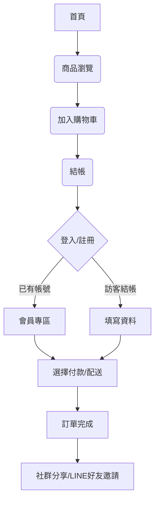

# 一佳香肉脯行｜品牌電商網站建置專案建議書

---

## 壹、專案背景

「一佳香肉脯行」為台東在地經營數十年的肉製品名店，主打黃金嬰兒豬肉鬆、蜜汁豬肉乾、五香豬肉條等經典產品。隨著消費型態數位化，品牌面臨拓展全台市場、搶佔送禮商機與升級品牌形象的挑戰。為因應市場變化，亟需建置專屬品牌電商平台，提升營運效能與市場競爭力。

---

## 貳、現況分析

### 1. 內部優勢
- 數十年傳承的獨家配方與工藝
- 產品具「台東名產」獨特定位，顧客忠誠度高

### 2. 內部劣勢
- 缺乏全國性銷售通路
- 品牌故事與價值未被充分傳達
- 傳統訂購方式限制訂單量能

### 3. 外部機會
- 零食、伴手禮電商市場龐大
- 企業送禮、團購需求高
- 遊客返家後的回購商機
- 年輕族群熱衷在地特色美食

### 4. 外部威脅
- 各大肉乾品牌競爭激烈
- 電商平台抽成與運費成本
- 消費者對食品安全與成分日益重視

---

## 參、需求與目標

### 1. 需求
- 建立品牌專屬電商網站，提升線上銷售能力
- 強化品牌故事與產品信任感
- 整合會員、金流、物流、行銷等功能
- 提供企業團購、禮盒包裝、食品履歷等加值服務

### 2. 目標
- 網站上線首年，線上訂單佔總營收15%以上
- 每月50筆以上訂單，客源遍及全台
- 建立10家以上企業合作，節慶禮盒銷售佔線上業績60%
- 累積100則以上顧客好評，建立食品履歷機制

---

## 肆、服務內容與規劃

### 1. 品牌電商網站建置
- 商品分類、規格化銷售、情境化描述
- 智慧推薦、禮盒包裝、代寫卡片
- 購物車、訪客結帳、社群快速登入（LINE/Facebook/Google）
- 多元金流（信用卡、LINE Pay、街口、轉帳）
- 彈性配送（自選到貨日、到店自取）

### 2. 行銷與會員互動
- 限量/倒數搶購、即時庫存顯示
- 一鍵社群發佈（FB粉專同步）
- 即時客服（Messenger/LINE視窗、Chatbot）
- 會員再行銷（感謝信、推薦碼、紅利點數、評論換點數）
- 社群分享按鈕（FB、LINE）

### 3. O2O整合與後台管理
- 門市據點頁（地址、營業時間、Google Map）
- 線上訂購、門市取貨
- 訂單自動化處理、出貨標籤自動列印（串接標籤機）

### 4. LINE官方帳號整合
- LINE聊天視窗、Chatbot
- LINE一鍵註冊/登入
- 分眾推播、活動訊息自動化
- 加入好友送優惠券、LINE Notify通知

### 5. 第二版功能（待開發）
- 食品履歷查詢（QR Code掃描）
- 批發客戶系統（專屬登入、批發價、批量下單、信用帳期）

---

## 伍、細部功能表

| 功能模組         | 主要功能說明                                                                 |
|------------------|------------------------------------------------------------------------------|
| 商品管理         | 商品分類、規格設定、庫存管理、情境圖上傳                                     |
| 訂單管理         | 訂單查詢、狀態更新、自動出貨標籤列印                                         |
| 會員管理         | 會員註冊/登入（含LINE/Facebook/Google）、會員等級、紅利點數、優惠券           |
| 行銷模組         | 限時搶購、倒數計時、社群分享、推薦碼、評論換點數                             |
| 金流整合         | 支援信用卡、LINE Pay、街口支付、銀行轉帳                                      |
| 配送管理         | 自選到貨日、到店自取、物流狀態查詢                                           |
| 客服互動         | 即時客服（Messenger/LINE）、Chatbot、常見問答                                 |
| O2O整合         | 門市據點頁、Google Map、線上訂購門市取貨                                      |
| LINE整合         | LINE聊天視窗、LINE Login、分眾推播、LINE Notify、好友優惠券                   |
| 食品履歷         | QR Code掃描查詢產品履歷、原料產地、過敏原資訊                                 |
| 批發專區         | 批發客戶登入、專屬價格、批量下單、信用帳期、專屬客服                          |

---

## 陸、技術規格

- **前端**：Vue 3 + Vite，RWD設計，API串接
- **後端**：Laravel，RESTful API，JWT/Session認證，多角色權限
- **資料庫**：MySQL，商品/訂單/會員/點數/優惠券/操作紀錄等資料表
- **第三方整合**：LINE Messaging API、LINE Login、Facebook Login、金流API、標籤機API
- **部署**：雲端主機、CDN、SSL憑證

---

## 柒、網站流程圖（Mermaid）

---

## 捌、執行時程

| 階段         | 內容                           | 預計時程   |
| ------------ | ------------------------------ | ---------- |
| 策略與設計   | 功能細節、架構、UX、視覺設計   | 1.5個月    |
| 建置與測試   | 前後台開發、商品上架、串接金物流| 2.5個月    |
| 上線與推廣   | 正式營運、行銷活動             | 長期經營   |

---

## 玖、預算建議

| 項目             | 預算（新台幣） |
| ---------------- | ------------- |
| 網站規劃設計     | 80,000        |
| 前後台系統開發   | 200,000       |
| 金流/LINE串接    | 30,000        |
| 伺服器/網域/SSL  | 20,000        |
| 行銷推廣         | 30,000        |
| 合計             | 360,000       |

---

## 拾、預期效益

- 拓展全台市場，提升營收與品牌能見度
- 強化顧客黏著度與回購率
- 降低人工作業成本，提升營運效率
- 建立食品安全信任，吸引新客群
- 提升企業形象，爭取更多合作機會

---

## 拾壹、結論

本專案將協助「一佳香肉脯行」數位轉型，打造兼具品牌力、行銷力與營運效率的電商平台，提升台東在地品牌競爭力，邁向全國市場。 